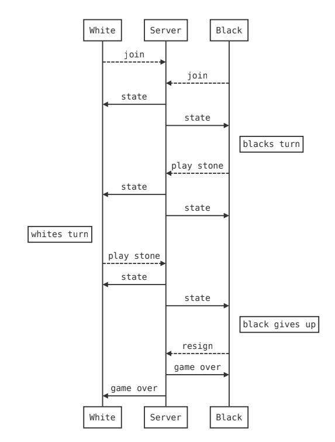
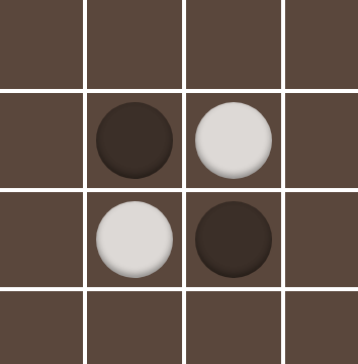

# Gothello-Server

### About

The gothello-server is responsible for implementing rules and communicating with clients. It is made of two APIs one working over a web-socket and one over HTTP. The web-socket API is used for real-time game communication while the HTTP api is used for match making.

We are using Spring as our web-server since its easy-ish to use
https://spring.io/guides/gs/rest-service/

## Getting Started

We use maven to manage our dependencies, tests, and builds

https://maven.apache.org/

1. Install maven. On Ubuntu this can be done with:

```
sudo apt install maven
```
2. Compile & Run. This should install all dependencies, compile, then run.

```
cd gothello-server
mvn spring-boot:run
```

You should now be able to connect to the server now.
http://localhost:8080/api/v0/game/new

# API



##### HTTP

* [`/api/v0/game/${id}`](#Game) - Get basic game meta-data
* [`/api/v0/game/${id}/state`](#Game State) - Get the game's state including the board
* [`/api/v0/game/new`](#New Game) - Create a new game
* [`/api/v0/game/join`](#Join Game) - Get the id of an open game

##### Web-socket

* [`state`](#State) - Informs the players of the game state including the board
* [`gameOver`](#Game Over) - Informs the players of the winner
* [`status`](#Status) - Informs the clients of an exception
* [`resign`](#Resign) - Informs the server a player has resigned
* [`pass`](#Pass) - Informs the server a player has passed
* [`playStone`](#Play Stone) - Informs the server a player has played a stone


## HTTP
The HTTP API is made of only GET requests with URL parameters

#### Game

Get details about a specific game

```
 /api/v0/game/${id}
```

```json
{
    "messageType": "game",
    "id": 293017601,
    "gameType": "PUBLIC",
    "gameFull": false,
    "open": true
}
```

* `id` The game id is used to refer to the Game
* `gameType` The type of game can be `PUBLIC, PRIVATE, SINGLE_PLAYER`
* `gameFull` Are both players in the game
* `open` Can someone join the game

#### Game State

Get the games current state

```
 /api/v0/game/${id}/state
```

```json
{
    "messageType": "state",
    "yourTurn": false,
    "yourStones": "WHITE",
    "turn": "BLACK",
    "board": [
        ["I","I","I","I","I","I","I","I"],
        ["I","W","B","I","I","I","I","I"],
        ["I","B","W","I","I","I","I","I"],
        ["I","I","I","I","I","I","I","I"],
        ["I","I","I","I","I","I","I","I"],
        ["I","I","I","I","I","B","W","I"],
        ["I","I","I","I","I","W","B","I"],
        ["I","I","I","I","I","I","I","I"]
    ],
    "turnNumber": 0
}
```

#### New Game

This endpoint will create a new game and return its game ID. This lets a client create a game if no open game exists. If it is a public game then it can be connected to through /api/v0/games/join. If it is private the game link must be shared manually. This lets users play with who they want to by sharing a link to a private game.

```
/api/v0/game/new?type="public/private/single-player"
```

```json
{
    "messageType": "game",
    "id": 293017601,
    "gameType": "PUBLIC",
    "gameFull": false,
    "open": true
}
```

#### Join Game
This endpoint will return a game that is open. This allows the client to connect with someone waiting for a game.

```
/api/v0/game/join
```

```json
{
  "messageType": "game",
  "id": 293017601,
  "gameType": "PUBLIC",
  "gameFull": false,
  "open": true
}
```

## Web-socket

Normal REST style API is good for managing the games but it is not ideal for actually playing the game. This is because only the client is allowed to make requests of the server. The server cannot update the client if state changes. Web-sockets are bidirectional letting the server update the client when the other player makes a move. We send JSON through the web-sockets allowing us to easily decode the messages.

* Each game has its own path based on the game id.
* All messages relating to the game are sent through this web-socket to the server.
* The server is responsible for keeping both clients up to date with the game state.

##### Connecting

Connecting to a game via a web-socket is easy. Use a web-socket client to connect to. It will wait for two clients to join before starting the game.

```bash
 ${ws|wss}://${endpoint}/api/v0/game/${game-id}/socket
 # e.g
 ws://localhost:8080/api/v0/game/1912937816/socket  
```

##### Board State Communication
We need a good way to communicate the boards state between the client and server. Each cell of the board can either be in one of the following states black, white or empty. However to keep the logic server-side we also want to be able to communicate which squares are legal moves and which are illegal moves. Since cells that are already occupied are always illegal we only need to split the empty cells into legal or illegal.

Each cell is one of the following:

* `B` - Black
* `W` - White
* `L` - Legal. A clear tile where the player could place a stone
* `I` - Illegal. A clear tile where a the player cannot place a stone

For example, below is an Othello board. It has been serialised using JSON into a 2D array of strings. It describes the legal moves for white.

```json
[
    ["I","L","I", "I"],
    ["L","B","W", "I"],
    ["I","W","B", "L"],
    ["I","I","L", "I"]
]
```



> By sharing legal and illegal moves we can offer visual feedback and validation, without having
> game logic in the client.

### Server to client

Messages sent from the server to the players/clients.

##### State

The most commonly used message will be the state message that sends the game state to the
players. Each player will be sent a unique board state since it can only be one persons turn.

```json
{
    "messageType": "state",
    "yourTurn": false,
    "yourStones": "WHITE",
    "turn": "BLACK",
    "board": [
        ["I","I","I","I","I","I","I","I"],
        ["I","W","B","I","I","I","I","I"],
        ["I","B","W","I","I","I","I","I"],
        ["I","I","I","I","I","I","I","I"],
        ["I","I","I","I","I","I","I","I"],
        ["I","I","I","I","I","B","W","I"],
        ["I","I","I","I","I","W","B","I"],
        ["I","I","I","I","I","I","I","I"]
    ],
    "turnNumber": 0
}
```

##### Game Over

When the game is over the server informs the players who won as well as score info. The score is currently the number of stones in a colour.

```json
{
    "messageType": "gameOver",
    "winner": "BLACK",
    "scores": {
        "black": 7,
        "white": 4
    },
    "isWinner": false
}
```

##### Status

If something goes wrong a message should be sent to help with debugging or to help the user. Exceptions come in multiple variants `DEFAULT, SUCCESS, ERROR, WARNING, INFO`.

For example when a player unexpectedly leaves the game:

```json
{
    "messageType": "status",
    "variant": "INFO",
    "message": "White has lost connection"
}
```

### Client to Server

Messages sent from the client/player to the server.

##### Resign

When someone is willing to give up they can resign and forfeit.

```json
{"type":"resign"}
```

##### Pass

If it is not advantageous for a player to place a stone they may pass.

```json
{"type":"pass"}
```

##### Play Stone

When a player plays a stone they need to tell the server. If it is not there turn an error is sent by
the server in response.

```json
{
    "messageType": "playStone",
    "row": 2,
    "col": 3
}
```

